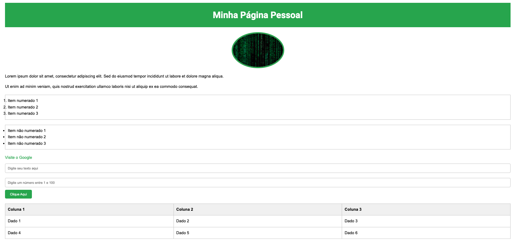

# Boas vindas ao desafio html! 🩷

Vamos colocar alguns conceitos de html e css em prática.

### 🗒 ANTES DE COMEÇAR A DESENVOLVER:

1. Clone o repositório
  * `git clone git@github.com:ligafemininadetiUVV/desafio-html.git`.
  * Entre na pasta do repositório que você acabou de clonar:
    * `cd desafio-html`

2. Crie uma branch a partir da branch `main`
  * Verifique que você está na branch `main`
    * Exemplo: `git branch`
  * Se não estiver, mude para a branch `main`
    * Exemplo: `git checkout main`
  * Agora, crie uma branch onde você vai guardar os `commits` do seu projeto
    * Você deve criar uma branch no seguinte formato: `seu-nome-e-sobrenome`
    * Exemplo: `git checkout -b carla-pereira`

3. Adicione as mudanças ao _stage_ do Git e faça um `commit`
  * Verifique que as mudanças ainda não estão no _stage_
    * Exemplo: `git status` (devem aparecer listados os novos arquivos em vermelho)
  * Adicione o novo arquivo ao _stage_ do Git
      * Exemplo:
        * `git add .` (adicionando todas as mudanças - _que estavam em vermelho_ - ao stage do Git)
        * `git status` (devem aparecer listados os arquivos em verde)
  * Faça o `commit` inicial
      * Exemplo:
        * `git commit -m 'iniciando o projeto.'` (fazendo o primeiro commit)
        * `git status` (deve aparecer uma mensagem tipo _nothing to commit_ )

4. Adicione a sua branch com o novo `commit` ao repositório remoto
  * Usando o exemplo anterior: `git push -u origin carla-pereira`

6. Crie um novo `Pull Request` _(PR)_
   * Vá até a página de _Pull Requests_ do [repositório no GitHub](https://github.com/ligafemininadetiUVV/desafio-html/pulls)
   * Clique no botão verde _"New pull request"_
   * Clique na caixa de seleção _"Compare"_ e escolha a sua branch **com atenção**
   * Clique no botão verde _"Create pull request"_
   * Adicione uma descrição para o _Pull Request_, um título claro que o identifique, e clique no botão verde _"Create pull request"_
   * No menu à direita, clique no link "Assignees" e escolha o seu usuário;
   * **Não se preocupe em preencher mais nada por enquanto!**
   * Volte até a [página de _Pull Requests_ do repositório](https://github.com/ligafemininadetiUVV/desafio-html/pulls) e confira que o seu _Pull Request_ está criado

7. **Ao terminar de desenvolver marcar na task lá no clickup que terminou de desenvolver**

8. Todas poderão fazer code review do código das outras, porém Micaeli e Juliana irão fazer de todas e caso seja necessário irão solicitar melhorias do código.  
-----

### 📝 AO DESENVOLVER:

1. Instale a extensão do VsCode chamada [Live Server](https://github.com/ritwickdey/vscode-live-server-plus-plus)
2. Ao escrever o inicio do código em html, na barra de ferramentas em baixo clique em `Go Live`, que vai abrir uma página html com o que vc está desenvolvendo.
3. Depois faça: 
 - Faça commits das alterações que você fizer no código regularmente;
 - Lembre-se de sempre após um (ou alguns) commits atualizar o repositório remoto: `git push`;
 - Os comandos que você utilizará com mais frequência são:
   - git status (para verificar o que está em vermelho - fora do stage - e o que está em verde - no stage);
   - git add (para adicionar arquivos ao stage do Git);
   - git commit (para criar um commit com os arquivos que estão no stage do Git);
   - git push (para enviar o commit para o repositório remoto).
-----

### 📅 PRAZO DE ENTREGA:

 - **Data de inicio:**  24/07/2024
 - **Data de final:**  31/07/2024
 - **Tempo total de desenvolvimento:**  1 semana
 - **Task de desenvolvimento:**  https://app.clickup.com/t/86a48ygnp
-----

### ✅ REQUISITO DO DESAFIO:

Você deve criar um site que com uma série de informações a respeito do que você sabe de desenvolvimento web.

#### Veja o exemplo de como pode se parecer depois de pronto. Lembre-se que você pode ~~e deve~~ ir além para deixar o projeto com a sua cara.

### ⚠️ EVITE O USO DE IAs (CHAT GPT), o desafio é para te ajudar no seu desenvolvimento ⚠️

### Requisitos

#### 1 - Seu site deve possuir uma barra superior com um título em h1

#### 2 - Altere a cor de fundo da barra superior

#### 3 - A página deve possuir uma foto 

#### 4 - A página deve possuir uma lista numerada

#### 5 - A página deve possuir uma lista não numerada

#### 6 - A página deve possuir pelo menos um link externo para abrir uma nova aba no navegador

#### 7 - Adicione um input do tipo texto

#### 8 - Adicione uma input do tipo numero com o máximo em 100 e o mínimo em 1

#### 9 - Adicione um botão

#### 10 - Crie parágrafos com um texto.

- Pode usar o gerador de texto [Lorem Ipsum](https://www.lipsum.com/)

#### 11 - Para o título a fonte deve ser uma fonte diferente baixada no [Google Fontes](https://fonts.google.com/)

#### 12 - A imagem deve ter bordas arredondadas

#### 13 - Adicione uma tabela 

#### 14 -  Altere o box model
- Altere margin, padding e border dos elementos para ver, na prática, como esses atributos influenciam e melhoram a visualização dos componentes

#### 15 - Altere atributos relacionados as fontes (alterar tamanho, cor e espaçamento entre as linhas)

#### 16 - Altere a linguagem de html

#### 17 - Altere o título a ser exibido na aba do navegador

